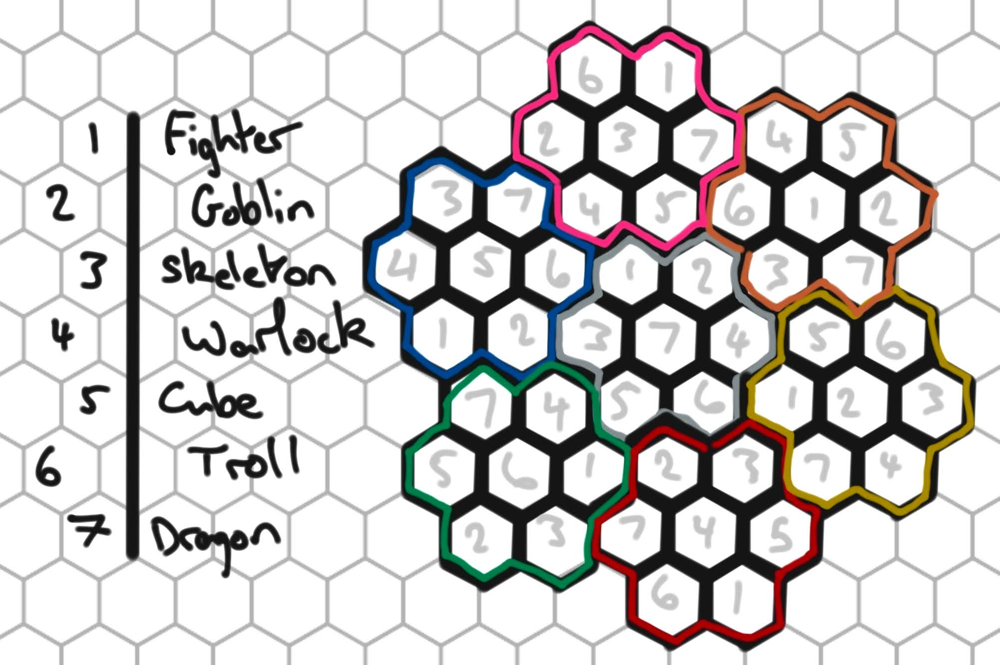

# Dunjoku

A hexagonal number-placement puzzle game built with Python and Pygame.



## Rules

Place the numbers 1–7 so that no value repeats within any:
- **Subgrid** — a 7-cell flower (center hex + its 6 neighbours)
- **Row** — cells sharing the same axial `r` coordinate
- **Diagonal** — cells sharing the same `q` or `q+r` coordinate

## How to play

- **Click** a cell to select it, then press **1–7** to place a number
- Duplicate violations are highlighted in red
- **Hint** — fills in a correct value for the selected cell
- **Clear** — removes the value from the selected cell
- **New Game** — returns to the difficulty selection screen

## Difficulty

| Level  | Cells removed |
|--------|--------------|
| Easy   | up to 20     |
| Medium | up to 30     |
| Hard   | up to 40     |

## Requirements

- Python 3
- [Pygame](https://www.pygame.org/) (`pip install pygame`)

## Running

```
python grid.py
```
